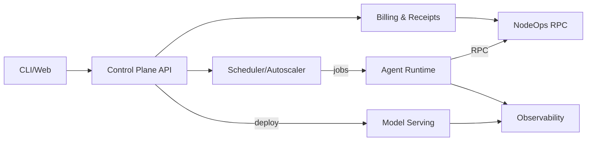

# NodeAI Agents Hub — Architecture Overview

This document summarizes the high‑level architecture and component responsibilities. See `docs/proposal.md` for the full end‑to‑end blueprint.

## System Diagram (ASCII)

```
                         +-----------------------+
 Web/CLI  ─────────────▶ |  Control Plane (API)  | ────────────────┐
                         +-----------------------+                 │
                                   │                               │
                                   ▼                               │
                         +-----------------------+                  │
                         |  Scheduler/Autoscaler |                  │
                         +-----------------------+                  │
                                   │                               │
                    +--------------+--------------+                │
                    |                             |                │
                    ▼                             ▼                │
          +-------------------+         +-------------------+      │
          |  Model Serving    |         |  Agent Runtime    |      │
          |  (GPU/CPU Pods)   |         |  (Workers)        |      │
          +-------------------+         +-------------------+      │
                    │                             │                │
                    ▼                             ▼                │
          +-------------------+         +-------------------+      │
          |  Feature/Cache    |         |  Tooling Adapters |      │
          |  (Redis/Vector)   |         |  (RPC, IPFS, etc.)|      │
          +-------------------+         +-------------------+      │
                    │                             │                │
                    └──────────────┬──────────────┘                │
                                   ▼                               │
                         +-----------------------+                  │
                         |  Observability Stack  |◀─────────────────┘
                         +-----------------------+
                                   │
                                   ▼
                         +-----------------------+
                         | Billing & Settlement  |
                         |  (On-chain + Stripe)  |
                         +-----------------------+
```

## Components

- Control Plane: auth, registries, provisioning, quotas/billing.
- Scheduler & Autoscaler: queues, predictive scaling, GPU bin‑packing.
- Model Serving: vLLM/ONNX/TensorRT servers with sidecars.
- Agent Runtime: workers, tools (RPC, storage, web), policy engine.
- Observability: Prometheus, Loki, Tempo/OTel, Grafana dashboards.
- Billing & Settlement: on‑chain receipts + Stripe fallback.

## Data Flows

1. Model Upload → Serve via object storage + deployments.
2. Inference path with sidecar metrics and billing.
3. Agent job execution with optional on‑chain transactions.

## Next

- Add mermaid diagrams, detailed request/sequence flows, and SLO docs.




